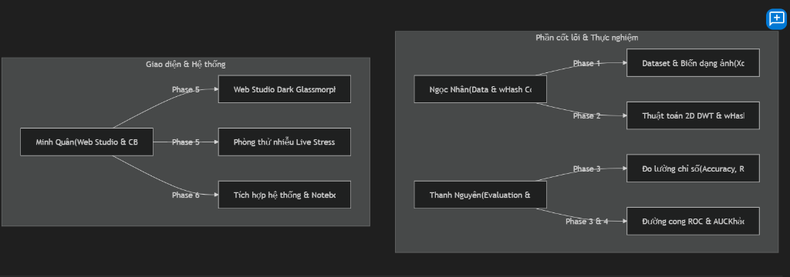

# Walkthrough: Thiết lập Kế hoạch & Tài liệu Lab 3 (Wavelet Image Hashing)

## Cập nhật thực hiện — Trần Ngọc Nhân, 15/09/2026

Đã đọc `plan.md`, `README.md`, `requirement.md`, walkthrough và sơ đồ `image.png`.
File `implementation_plan.md` được liên kết bên dưới nằm ngoài dự án trên máy thành viên khác,
không có bản cục bộ để đọc. Các phần bên dưới mục cập nhật này lưu lại kế hoạch ban đầu.

Phần được triển khai: **Phase 1–2** theo bảng phân công.

1. [Module lõi](../vision_wavelet.py): đọc ảnh, 15 biến dạng, lập cặp ảnh,
   DWT bằng PyWavelets, wHash 64/256 bit, median/mean, Hamming, xuất hash và khoảng cách.
2. [Dữ liệu](../data/dataset_pairs.json): 15 nguồn, 225 biến thể, 330 cặp có nhãn;
   từng nguồn và tham số được lưu rõ ràng để tái lập và chia tập theo nguồn.
3. [Notebook](../Lab3.ipynb): giải thích tiếng Việt, ảnh gốc/biến dạng,
   bốn băng tần, bit hash và bảng khoảng cách thực nghiệm.
4. [Kiểm thử](../test_vision_wavelet.py): đối chứng Haar giải tích, tái dựng 6 họ wavelet,
   hash 64/256 bit, Hamming, tính tái lập và kiểm tra chỉ mục dữ liệu.
5. [Hướng dẫn](../README.md): lệnh chạy, API bàn giao và giới hạn.

Ảnh kết quả được notebook sinh trong `../results/`.
Thanh Nguyên tiếp tục Phase 3–4; Minh Quân tiếp tục Phase 5. Phase 6 chưa hoàn tất toàn nhóm.

---

Đã hoàn thành việc phỏng vấn làm rõ yêu cầu (/grill-me) và tạo lập toàn bộ hệ thống tài liệu, bảng phân công nhiệm vụ chi tiết và hướng dẫn kỹ thuật cho **Lab 3: So sánh sự tương đồng hình ảnh sử dụng Wavelet Hashing (Bài thực hành 4 - Chương 3 Part 1)**.

---

## 📁 Các tệp đã tạo & Cập nhật (Files Created & Updated)

| Tệp | Đường dẫn | Mô tả nội dung |
|---|---|---|
| **Yêu cầu bài tập** | [lab3/requirement.md](file:///d:/Computer%20Vision/Lap/lab3/requirement.md) | *(Mới cập nhật)* Văn bản đề bài gốc: mục tiêu thực hành, 5 bước thực nghiệm (dữ liệu, trích xuất wavelet LL, sinh mã băm wHash, khoảng cách Hamming, đánh giá Accuracy/Recall/Specificity/ROC) và 2 bài tập nâng cao (khảo sát đa họ wavelet & ứng dụng tìm kiếm ảnh CBIR). |
| **Kế hoạch & Phân công** | [lab3/plan.md](file:///d:/Computer%20Vision/Lap/lab3/plan.md) | Bảng mục tiêu bài toán (What does the lab do?), bảng phân công công việc chi tiết cho 2 thành viên (**Ngọc Nhân**, **Thanh Nguyên**) và **Minh Quân**, kèm checklist mã ID cho từng Phase. |
| **Tài liệu Hướng dẫn** | [lab3/README.md](file:///d:/Computer%20Vision/Lap/lab3/README.md) | Tổng quan lý thuyết 2D DWT, nguyên lý thuật toán wHash, đánh giá ROC/AUC, cấu trúc thư mục, hướng dẫn cài đặt môi trường (`pip install pywavelets ...`) và hướng dẫn chạy Web Studio / Notebook / Script. |
| **Kế hoạch Kỹ thuật** | [implementation_plan.md](file:///C:/Users/quan2/.gemini/antigravity-ide/brain/eb7b7374-18f2-4e3d-9c3c-3b32806e11bd/implementation_plan.md) | Tài liệu kiến trúc hệ thống và lộ trình kỹ thuật đầy đủ 6 Phase. |

---

## 👥 Tóm tắt Phân công Nhiệm vụ (Team Roles Summary)

---

## 📋 Chi tiết các Phase & Đầu mục công việc

### Phase 1: Chuẩn bị Dữ liệu (Phụ trách: Ngọc Nhân)
- **1.1:** Thu thập tập ảnh gốc đa dạng (15-20 ảnh mẫu).
- **1.2:** Xây dựng bộ sinh biến thể ảnh tương tự (xoay góc, co giãn, chỉnh sáng).
- **1.3:** Sinh biến thể nhiễu & nén (Gauss, muối tiêu, nén JPEG, làm mờ).
- **1.4:** Tạo tập cặp ảnh khác biệt (Dissimilar negative pairs).
- **1.5:** Đóng gói file chỉ mục và gán nhãn Ground Truth (`dataset_pairs.json`).

### Phase 2: Thuật toán wHash & Khoảng cách Hamming (Phụ trách: Ngọc Nhân)
- **2.1:** Tiền xử lý ảnh (Grayscale, chuẩn hóa kích thước cố định).
- **2.2:** Cài đặt 2D DWT (`pywt.wavedec2`) trích xuất $LL, LH, HL, HH$.
- **2.3:** Lượng tử hóa hệ số $LL$ theo Median/Mean $\rightarrow$ Sinh mã băm 64-bit / 256-bit.
- **2.4:** Cài đặt hàm tính khoảng cách Hamming và % tương đồng.
- **2.5:** Đóng gói module `WaveletHasher` trong `vision_wavelet.py`.

### Phase 3: Đánh giá Hiệu suất & Đường cong ROC (Phụ trách: Thanh Nguyên)
- **3.1:** Quét ma trận khoảng cách Hamming trên toàn bộ tập dữ liệu.
- **3.2:** Quét ngưỡng phân loại $\theta \in [0, N_{\text{bits}}]$.
- **3.3:** Tính toán các chỉ số: Accuracy, Sensitivity (Recall), Specificity, Precision, F1-Score.
- **3.4:** Vẽ đường cong ROC (TPR vs FPR) và tính diện tích dưới đường cong (AUC).
- **3.5:** Xác định ngưỡng tối ưu (Youden's J) và vẽ Ma trận nhầm lẫn (Confusion Matrix).

### Phase 4: Bài tập Nâng cao 1 — Khảo sát Đa phương pháp (Phụ trách: Thanh Nguyên)
- **4.1:** Khảo sát các họ Wavelet (`haar`, `db2`, `db4`, `sym4`, `bior2.2`, `coif2`).
- **4.2:** Khảo sát cấp độ phân giải (Level 1-4) & kích thước Hash ($8\times8$ vs $16\times16$).
- **4.3:** So sánh đối đầu với `aHash`, `dHash`, `pHash`.
- **4.4:** Kiểm thử độ bền vững (Robustness Test) & đo thời gian thực thi (Latency Benchmark).
- **4.5:** Tổng hợp bảng so sánh và biểu đồ phân tích trong notebook.

### Phase 5: Bài tập Nâng cao 2 — Web Studio & CBIR (Phụ trách: Minh Quân)
- **5.1:** Thiết kế Web UI Dark Glassmorphism (HTML5 Canvas + Vanilla CSS/JS).
- **5.2:** Trực quan hóa 4 băng tần Wavelet ($LL, LH, HL, HH$) và ma trận bit nhị phân.
- **5.3:** Bộ so khớp 2 ảnh trực tiếp (Dual Image Matcher) kèm Live Hamming distance.
- **5.4:** Phòng thí nghiệm biến dạng trực tiếp (Live Robustness Stress Lab).
- **5.5:** Công cụ tìm kiếm ảnh tương đồng Top-K (Content-Based Image Retrieval - CBIR).

### Phase 6: Tích hợp Hệ thống & Đóng gói (Cả nhóm thực hiện)
- **6.1:** Hoàn thiện mã nguồn `vision_wavelet.py`.
- **6.2:** Hoàn thiện Notebook thực nghiệm `Lab3.ipynb`.
- **6.3:** Cập nhật tài liệu `README.md` và `plan.md`.
- **6.4:** Kiểm thử toàn diện hệ thống.

---

## 🚀 Các bước tiếp theo (Next Steps)
1. Bắt đầu triển khai mã nguồn module [`lab3/vision_wavelet.py`](file:///d:/Computer%20Vision/Lap/lab3/vision_wavelet.py) đóng gói thuật toán wHash và bộ sinh dữ liệu.
2. Xây dựng giao diện [`lab3/web/`](file:///d:/Computer%20Vision/Lap/lab3/web/) tương tác với đầy đủ các tính năng trực quan hóa và CBIR.
3. Tạo notebook thực nghiệm [`lab3/Lab3.ipynb`](file:///d:/Computer%20Vision/Lap/lab3/Lab3.ipynb) với các bước chạy chi tiết và biểu đồ phân tích.
